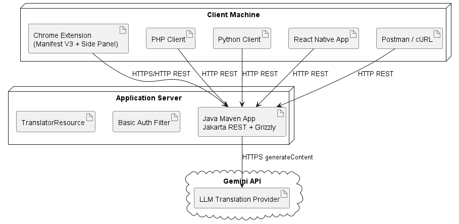

# Darija Translator: LLM-Powered REST API

A RESTful web service in Java that translates English into **Moroccan Darija** using Google Gemini, with four different clients (Chrome extension, PHP web app, Python CLI, and React Native mobile app) all talking to the same API.

The project demonstrates a distributed architecture where heterogeneous clients interoperate with one central service over standard HTTP.



## Features

- **Java REST API** built with Jakarta RESTful Web Services (JAX-RS, Jersey + Grizzly)
- **Basic Authentication** on the translation endpoint
- **LLM translation** through the Google Gemini API
- **Automatic fallback** to a local dictionary-based translator when no API key is set or the API is unavailable (rate limits, high demand)
- **Four clients** on four platforms, sharing one API
- **UML documentation** (class, deployment, sequence, and use-case diagrams) and an **OpenAPI spec**

## Project structure

```
llm-darija-translator-service/   Java REST API (Maven)
chrome-extension/                Chrome extension client (Manifest V3, side panel)
php-client/                      PHP web client
python-client/                   Python CLI client
react-native-client/             Mobile client (Expo)
uml/                             PlantUML sources
out/uml/                         Rendered UML diagrams (PNG)
docs/                            OpenAPI spec and Postman collection
```

## API

| Method | Endpoint | Description | Auth |
|---|---|---|---|
| GET | `/translator/health` | Health check | No |
| GET | `/translator/info` | Service information | No |
| POST | `/translator/translate` | Translate text into Darija | Yes (Basic) |

**Request**

```json
{
  "text": "Hello, how are you?",
  "sourceLanguage": "English",
  "targetLanguage": "Moroccan Darija"
}
```

**Response**

```json
{
  "sourceText": "Hello, how are you?",
  "translatedText": "salam, labas 3lik?",
  "sourceLanguage": "English",
  "targetLanguage": "Moroccan Darija",
  "provider": "gemini-3.5-flash-lite"
}
```

The `provider` field shows which engine answered: the Gemini model, or the local fallback.

The full specification is in [`docs/openapi.yaml`](docs/openapi.yaml), and a ready-to-import Postman collection is in [`docs/postman_collection.json`](docs/postman_collection.json).

## Running the backend

**Requirements:** Java 17+, Maven 3.9+

**1. Set environment variables**

```bash
export APP_USERNAME=admin
export APP_PASSWORD=change-me
export GEMINI_API_KEY=your-gemini-api-key
export GEMINI_MODEL=gemini-3.5-flash-lite   # optional, this is the default
```

On Windows PowerShell, use `$env:GEMINI_API_KEY="your-gemini-api-key"` (and the same for the others).

If `APP_USERNAME` and `APP_PASSWORD` are not set, the service falls back to development defaults (`admin` / `admin123`). Always set your own credentials outside local testing. Without `GEMINI_API_KEY`, the service uses the local fallback translator.

**2. Build and run**

```bash
cd llm-darija-translator-service
mvn clean package
java -jar target/llm-darija-translator-service-1.0.0-jar-with-dependencies.jar
```

The service runs at `http://localhost:8080`.

**3. Test it**

```bash
curl http://localhost:8080/translator/health

curl -X POST http://localhost:8080/translator/translate \
  -u admin:change-me \
  -H "Content-Type: application/json" \
  -d '{"text":"Thank you","sourceLanguage":"English","targetLanguage":"Moroccan Darija"}'
```

## Clients

### Chrome extension

Translates text you select on any web page, via the right-click menu, in a side panel.

1. Open `chrome://extensions`
2. Enable **Developer mode**
3. Click **Load unpacked** and select the `chrome-extension` folder

### PHP web client

```bash
cd php-client
php -S localhost:8000
```

Then open http://localhost:8000.

### Python CLI client

```bash
cd python-client
pip install -r requirements.txt
python client.py
```

### React Native mobile client (Expo)

```bash
cd react-native-client
npm install
npx expo start
```

On a physical phone, `localhost` points to the phone itself, not your computer. Set `API_URL` in `App.js` to your computer's local IP address, for example `http://192.168.1.20:8080/translator/translate`.

## UML diagrams

| Diagram | Source | Image |
|---|---|---|
| Class | [`uml/class-diagram.puml`](uml/class-diagram.puml) | [PNG](out/uml/class-diagram/class-diagram.png) |
| Deployment | [`uml/deployment-diagram.puml`](uml/deployment-diagram.puml) | [PNG](out/uml/deployment-diagram/deployment-diagram.png) |
| Sequence | [`uml/sequence-diagram.puml`](uml/sequence-diagram.puml) | [PNG](out/uml/sequence-diagram/sequence-diagram.png) |
| Use case | [`uml/use-case-diagram.puml`](uml/use-case-diagram.puml) | [PNG](out/uml/use-case-diagram/use-case-diagram.png) |

## Note: Arabic script in Windows PowerShell

PowerShell may display Arabic-script output incorrectly because of console encoding. To view it properly, write the result to a UTF-8 file:

```powershell
$response.translatedText | Out-File result.txt -Encoding utf8
notepad result.txt
```

## What this project demonstrates

- REST API design and endpoint security
- Integrating an LLM API with a graceful fallback
- Interoperability between clients on four different platforms
- Software design documentation with UML and OpenAPI

## Author

Kenza Qribis, Al Akhawayn University
